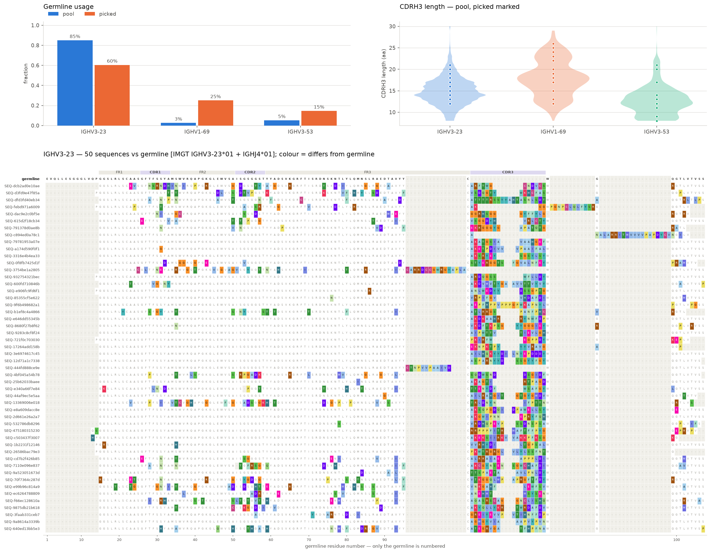
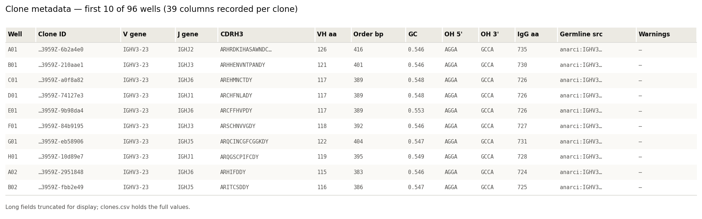
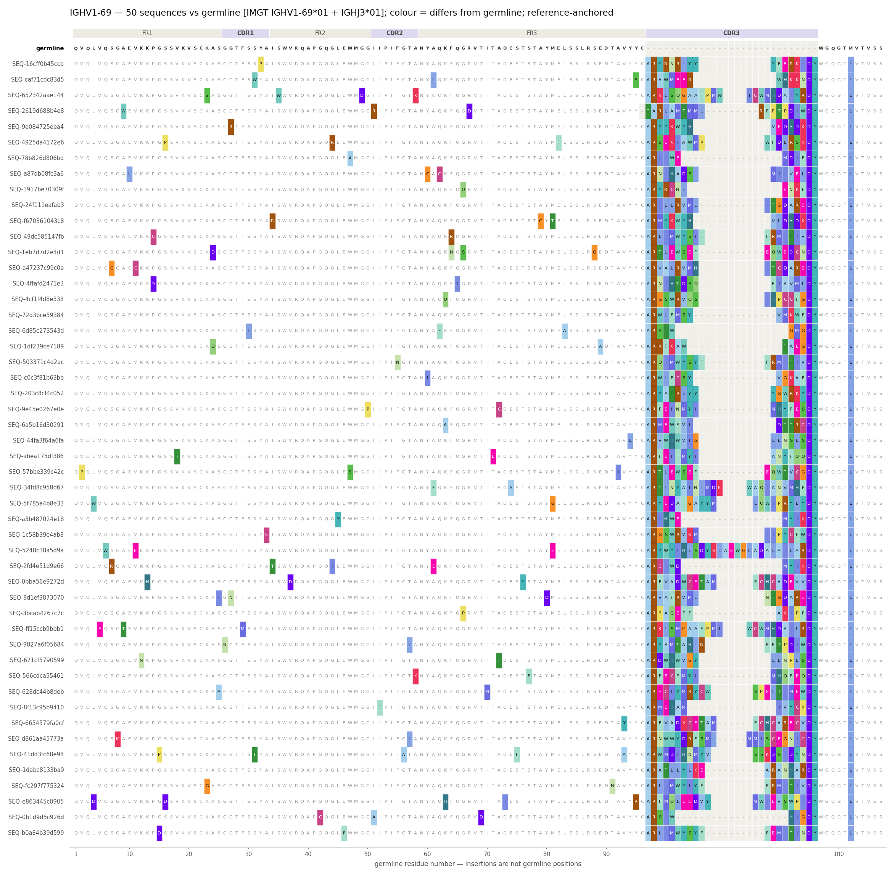
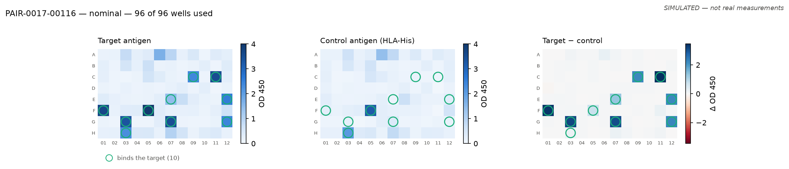
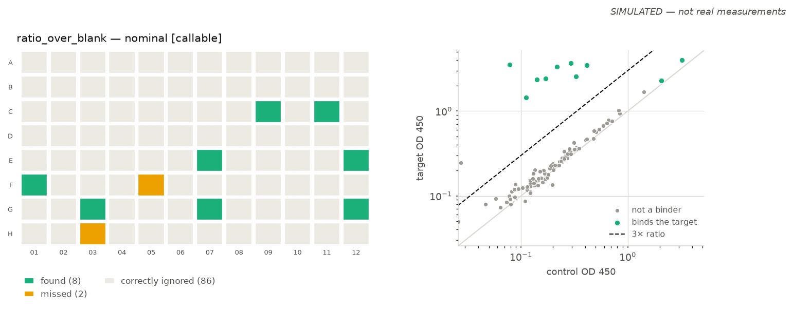

# plateforge

This project is to demo a workflow that could benefit significantly from an interactive experience (agent) that helps plan experiments, generate virtual representations, track workflows and sample IDs across different (connected) experiments, reformat and process data when necessary to generate files, and generate low-lift/standard figures for basic experimental workflows in the wet lab.

As an example, I chose to simulate antibody discovery workflows.

A major version was uploaded, produced by code `5d2e3b0` on 2026-09-24. Re-running mints a new `LIB` id and a new directory (gitignored).  New versions are not documented each time in this README; please see github's usual tracking.

> **Status:** Data layers v0 are built, architecture is sketched out.  development is focused on a functional workflow from start to finish for standardized input.  Expanding tolerance of different inputs/formats at different steps of the workflow will be most of the focus of dev for this project.
>
> Steps 1–5 run end to end on real input. Step 6 runs on simulated plates only. `reagents` is still a stub.

---

# Part 1 — the workflow

What the pipeline does, step by step. Worked numbers, figures and outputs are in Part 2.

### 1. obtain antibody sequences
1. antibodies are discovered or sequences are generated (i.e. synthetic library) - an input list for an experiment should at minimum have a full aa sequence.  For this project, full VH's will be sourced from OAS.
2. curate/filter input sequence list - select for target diversity
3. align within V gene family, germline as the reference

Selection is greedy farthest-point on normalised CDRH3 edit distance, one CDRH3 per clone — two wells of the same molecule is not a screen. Alignment is per V family against that family's own IMGT germline; the germline is the top row and the only numbered one, and colour marks departure from it. Gap penalties are region-aware: frameworks held tight, CDRs relaxed, and CDR3 treated as one contiguous block between the conserved Cys104 and Trp118 so a length difference reads as a length difference rather than as confetti.

### 2. bioinformatically process sequences for cloning
1. sequences are built into a table and given a master sequence ID - immutable and forever unique
2. generate DNA sequences to be synthesized. VH + (fixed) VL, two cassettes.
outs:
2A) order forms — our own table always; vendor layouts when a real template exists
2B) table with metadata for sequences: cloneID, clone_aa_seq, clone_DNA_seq (Hu codon opt), Frag_to_order (Golden Gate/BsaI), Hu_germline (query IMGT)
2C) alignments (within VH family) for the clones to be synthesized
3. generate plate map for DNA sequences as expected from vendor - to be verified against documentation provided by vendor at order

What is ordered is the **VH alone**. The vector carries everything else.

**Vector: `pcdna-igg1-dual-vk-v1`** — two promoters, two transcripts, ~6.8 kb:

- **CMV → HC.** Kozak, Ig-kappa leader, **VH (ordered)**, IgG1 CH1–hinge–CH2–CH3, stop, BGH polyA
- **CAG → LC.** Kozak, its own leader and start codon, fixed IGKV1-39/IGKJ1 VL (junction `STP`), CK, stop, SV40 polyA

Two cassettes rather than one T2A ORF because IgG assembly wants light chain in excess of heavy, and with a 2A peptide the downstream chain is always the lower one. Two promoters make the ratio a design parameter instead. CAG is the stronger promoter and it drives the light chain, on purpose. Different polyA on each cassette, also on purpose: a repeated several-hundred-bp element in one plasmid invites recombination.

### 3. generate experiment for cloning in wet lab
1. using plate map from 2), calculate master mixes required for cloning.
*Golden Gate/TypeIIs is most robust for quick-cloning:
pre-digested vector, DNA fragments (digest delivered frags in-plate), T4 ligase.
Built-in selection against wrong products: vector recircularizes without insert - recognition site regenerated and re-cut in same rxn, equilibrium is pushed toward correct ligation*
2. generate Sanger sequencing order forms (plate format)

Three vendors, three well spellings, two fill directions — a column-major plate pasted into a row-major form is a 96-well transposition that every later step preserves and nothing downstream can detect. Each emitter converts once on the way out, and enforces the limits its own template states *before* writing rather than at upload.

### 4. verify the clones (Sanger)
1. read the `.ab1` files back
2. judge each well against what it was supposed to contain
3. resolve repeat runs

The output is **which wells are usable**, not a pile of sequences.

- **The trace knows where it came from.** An ABIF file carries the well, plate barcode, run start time, instrument and the vendor's own name, all written by the sequencer. The well is never parsed out of a filename, and repeat runs are ordered by the instrument's clock rather than by file mtime — which downloading rewrites, usually backwards.
- **Trim, then align.** Mott's algorithm on the Phred scores first; untrimmed 5′ noise aligns to *something* and produces confident mismatches that read as real mutations.
- **Screen against all 96 inserts, not just the well's own.** A read matching a different well is a plate swap, and it is the failure that quietly poisons everything downstream. Screened on the **insert**, since all 96 share the same vector flanks.

| verdict | meaning | usable |
|---|---|---|
| `exact` | the insert is what we ordered | ✓ |
| `silent` | bases differ, protein does not | ✓ |
| `missense` | the protein differs | only if you meant it |
| `indel` | in-frame insertion or deletion | alive, not what was ordered |
| `frameshift` | indel not a multiple of 3 | dead |
| `mixed` | two colonies; ambiguity codes through a good trace | re-streak |
| `no_insert` | vector all the way through | empty backbone |
| `wrong_clone` | matches a different well's insert | **plate swap** |
| `low_quality` / `unreadable` | never cleared the floor, or no alignment | re-run |

### 5. plates through the lab

The clone is tracked; plates are containers it passes through; steps are registry entries.

```
transfect → harvest_supernatant → add_beads → immunoprecipitate →
elute_neutralise → magnet_transfer → quantify_bli → normalise
```

`plan` has no side effects; `record` takes what actually happened, with operator, reagent lots and deviations. A human-performed step has the same shape as a robot one — the protocol does not fork on who did the work. Every well records which clone it descends from and which well it came from, so a well traces back to the plate it was ordered on across as many rearrays as the campaign takes.

Worklists come out per instrument, each declaring how well its format is actually known — `verified`, `documented`, `sketch`. Tecan `.gwl` and Opentrons are `documented`; INTEGRA, Hamilton, Beckman and Agilent refuse and say what file would unblock them.

### 6. ELISA and hit calling

Paired, position-identical target and control plates. A clone is a hit because its target signal beats **its own** control signal — which cancels anything affecting a clone equally on both plates (how much IgG was prepped, how sticky it is, how the row was pipetted).

**A caller is allowed to refuse.** On some plates no threshold is correct, and the honest output is `uncallable` rather than a short confident list. Four callers in a registry; the default requires a ratio *and* a robust z, because they fail in different directions.

---

# Part 2 — demo dataset

One run of the above. Everything here is re-runnable: each script writes a bundle with its parameters, the code version and its outputs in one directory.

### 1. sequences (input) — real data

- **Source.** OAS (Observed Antibody Space), unpaired heavy chain, `human`, study `Briney et al., 2019`. Read via the HuggingFace parquet mirror — OPIG's own download paths return 403 and OAS has no API.
- **Filter.** 616,809 rows scanned → 19,870 kept. Productive only; V gene in the panel; CDRH3 8–30 aa; ANARCI liabilities dropped (5′ truncation notes are primer design, not defects); no ambiguous residues.
- **Selection.** 96 chosen by greedy farthest-point sampling on normalised CDRH3 edit distance (seed 42). By germline: IGHV3-23 58, IGHV1-69 24, IGHV3-53 14.
- **Alignment.**
  - IGHV3-23: 50 seqs, median identity to germline 0.7944. Reference: IMGT IGHV3-23*01 + IGHJ4*01.
  - IGHV1-69: 24 seqs, median identity to germline 0.743. Reference: IMGT IGHV1-69*01 + IGHJ4*01.
  - IGHV3-53: 14 seqs, median identity to germline 0.8019. Reference: IMGT IGHV3-53*01 + IGHJ4*01.



The alignment is checked against `cdr3_aa`, which is carried alongside every OAS row and is never an input to the alignment: the rendered junction matches it for 150 of 150 rows, with no sequence's CDR3 displaced from the stack.

| File | Holds |
|---|---|
| `manifest.json` | the whole query: source, filter, seed, code version |
| `selected.csv` | the 96 sequences, in rank order |
| `pool_summary.csv` | what they were drawn from, per germline |
| `filter_funnel.csv` | rows surviving each filter step |
| `alignment_<gene>.png` `.fasta` `.aln.txt` | one alignment per germline |

### 2. constructs — what actually gets ordered





| Table | One row per | Holds |
|---|---|---|
| `clones.csv` | clone | `clone_id`, `seq_id`, construct format, protein and DNA sequence, length, GC, Type IIs sites removed, synthesis warnings, germline and its source, `well`, `plate_barcode` |
| `plate_map.csv` | well | `well` (A01, column-major), `clone_id`, `cdr3_aa`, `dna_length`, `gc` — the layout as a vendor ships it |
| `plate_map.txt` | — | the same grid, for reading at the bench |
| `order_generic.csv` | well | our own order table |
| `order_<vendor>.csv` | well | the vendor's own layout, with a caveat file until a real template exists |
| `vector.json` | — | the insertion context these fragments were designed for |

Every vendor table is derived from `clones.csv` rather than regenerated, so what is ordered and what is recorded cannot drift apart.

### 3. sequencing order forms

| form | vendor | wells | fill order |
|---|---|---|---|
| `genewiz` *(default)* | Azenta / GENEWIZ | `A01` | gives both, as two columns |
| `elim` | ELIM Biopharmaceuticals | `A1` | row-major |
| `ucberkeley` | UC Berkeley DNA Sequencing Facility | `A1` | column-major |
| `generic` | — | `A01` | ours |

All three written against the vendor's own template, committed in `fixtures/sequencing/`. Azenta's is the one that fails quietly — its `Well (H)` and `Well (V)` columns are two orderings of the same 96 positions paired row by row — so a test reads their template and asserts our pairing equals theirs for all 95 rows.

### 4. sequence verification — real traces

Three real Azenta `.ab1` files in `fixtures/sanger/`:

| file | well | mean Q | Q20 bases | what it is |
|---|---|---|---|---|
| `194-M13F.ab1` | F5 | 42.4 | 828 / 929 | a clean forward read |
| `194-M13R.ab1` | G5 | 32.1 | 719 / 959 | the same insert, reverse |
| `194-3xP3.ab1` | H5 | 11.8 | 54 / 832 | a failed read |

The first two read the same molecule from opposite ends, so their overlap must be a perfect reverse complement. It is — **253 bp, 100% identity, zero mismatches, zero gaps** — which checks the parser, the quality decode, the trim, the reverse complement and the aligner in one test, on real data. The third pins that a dead well is reported as dead rather than having a sequence read into it.

Repeat runs are grouped by the sample name the submitter typed (markers `_RR`, `-rerun`, `_redo`, `run2`, `v2`, `(2)` — never a bare `_2`, which is usually a plate) and ordered by run timestamp. Nothing is deleted; the loser is superseded. The later run is **not** assumed better — a replacement with fewer Q20 bases is flagged. Anything ambiguous goes to a human.

**Out:** `calls.csv`, `usable_wells.csv`, `reruns.csv`.

### 5. plates — lineage only

No real plate data yet. The chain runs on registered virtual plates, and a well traces back through every container it passed through.

### 6. ELISA and hit calling — **SIMULATED**

**Synthetic. Not measurements.** Generated so the analysis path can be built before real reads exist; every file and every figure says so on its face.



The dataset is deliberately hard. A first version with a fixed hit rate was 99.6% separable and taught nothing; drawing the hit rate per panel (including zero), giving the control antigen real binders of its own, and adding per-well failures that are *independent between the two plates* brought it to ~78%.



Two findings that went against the obvious design, both measured over 600 simulated pairs:

- **Saturation goes with *better* calls**, not worse — F1 0.60 below 2% saturated against 0.92 above 20% — because a well only reaches the reader ceiling when something really bound. What is lost at the ceiling is the ability to *rank*, not to call. So saturation is flagged, never refused on.
- **Dynamic range is what predicts calling quality** — top decile over background. F1 0.46 below 12×, 0.84 above 30×. Hence refusal thresholds at 10× and 25×, giving tiers of F1 0.81 / 0.48 / 0.24 and ~10% of plates refused.

### regenerating all of it

```bash
python scripts/fetch_oas.py --study "Briney et al., 2019" --limit 20000 \
    --genes IGHV3-23 IGHV3-53 --pick 96 --align-rows 50
python scripts/order.py --lib LIB-... --barcode PLATE-001
python scripts/sequencing.py order --clones .../clones.csv --vendor genewiz --primer CMV_F
python scripts/sequencing.py verify --clones .../clones.csv --traces ~/Downloads/seq/
python scripts/simulate_elisa.py --pairs 600 --register 2
python scripts/call_hits.py --pairs 600 --seed 17
python scripts/readme_figures.py          # refreshes docs/figures/
python scripts/run_all.py                 # all of the above, with a record
```

---

# Data architecture v0

Five modules, deliberately independent:

| Module | Responsibility |
|---|---|
| `core` | IDs, well coordinates, named stores, the artifact ledger, extension registries, the figure palette |
| `library` | Sequence acquisition, classification, in-silico construct reformatting, Sanger verification |
| `assay` | Experiment definition, plate layout, reader ingest, QC, hit calling, picking |
| `reagents` | Reagent catalog, lot tracking, and rules that raise assay caveats |
| `emit` | Worklists, sequencing forms, and reports for external systems |

**Modules never import each other.** A module produces something, registers it in a ledger with a typed ID, and returns that ID. The next module resolves the ID. Provenance becomes a queryable graph rather than a call stack, and every module runs and tests independently.

**The clone is the durable entity.** IDs are minted once and carried forward. A clone stays traceable from growth plate through ELISA plate through rearray to sequencing tube, across as many physical plate changes as the campaign takes.

**Extension happens through registries, not edits.** A new instrument format, a new hit-calling strategy, a new construct scaffold, or a new reagent rule is a new file plus a one-line registration. Existing code does not move.

**Formats are verified, never guessed.** Anything that parses or writes a file for an external system requires a real example of that format, committed as a fixture and documented, before the code is written. Guessed formats are how a tool like this quietly produces wrong results.

**Claims are re-runnable, not asserted.** Every number above comes out of a script that writes a run bundle, on the machine that ran it.

## What is verified against a real file

| Fixture | Verifies |
|---|---|
| `fixtures/sanger/*.ab1` | 3 real Azenta traces — the ABIF reader |
| `fixtures/backbone/pcDNA3.1.dna` | the SnapGene reader; 5,428 bp, 13 features, self-checked on load |
| `fixtures/sequencing/*` | all three vendors' order forms |
| `fixtures/uniprot/*.fasta` | the IgG1 and CK constant regions |

Still wanted: a real Gen5 export, a plate with a known positive control, INTEGRA and Octet exports, vendor upload templates, a Sanger rerun pair or submission manifest. `fixtures/README.md` lists what each one unblocks.

## Layout

```
src/plateforge/
  core/       ids, wells, paths, stores, bulk, artifact ledger, registries, style
  library/    sequence acquisition, reformatting, Sanger verification
  assay/      experiments, plates, ingest, ELISA, hit calling, figures
  reagents/   catalog, lots, caveat rules
  emit/       worklists, sequencing order forms, reports
scripts/      one per stage, each writing a run bundle
fixtures/     real example files from external systems
docs/formats/ notes on each external format
docs/figures/ the figures this README points at
decisions/    dated architecture decision records (0001–0025)
config/       JSON experiment definitions and schemas
tests/        386 tests, no network, no instrument required
```

`CLAUDE.md` holds the working rules that keep the modules independent.
`decisions/` explains why the structure is what it is.
`docs/pipeline.md` is the command-by-command tour.

## Roadmap

- [x] Core: typed IDs, well normalisation, paths, SQLite stores, parquet bulk tables, artifact ledger
- [x] `library`: OAS interface, sequence pool, diversity-aware sampling
- [x] `library`: germline-anchored alignment, run bundles, the ordering path
- [x] `library`: Sanger verification — ABIF, SnapGene, DNA alignment, verdicts
- [ ] `library`: in-silico reformatting (scFv, VHH, VH-only, CDRH3 grafting)
- [ ] `library`: build the dual cassette on the real pcDNA3.1 backbone
- [x] `assay`: plate lineage, steps, protocol chain
- [x] `assay`: reader adapters, grid finding, plate↔virtual assignment
- [x] `assay`: hit calling with an honest refusal
- [x] `assay`: review plots
- [ ] `assay`: experiment definition from JSON
- [ ] `assay`: control resolution, interactive pick sessions
- [ ] `reagents`: catalog, lot tracking, caveat rules
- [x] `emit`: liquid handler worklists, sequencing order forms
- [ ] `emit`: run summaries

## Conventions worth knowing

- Wells are always zero-padded: `A01`, never `A1`
- Unanticipated fields go in a JSON `meta` column, queried with `json_extract`,
  and get promoted to real columns once they recur
- Experiment configuration is JSON validated against a schema, so an agent can
  write the same file a human does
- Synthetic data is stamped `SIMULATED` on the figure itself, not just in the
  manifest. Generated figures go to `figures/` (gitignored); committed README
  figures live in `docs/figures/`. Never mixed — a synthetic figure presented
  as real is the worst mistake this repo can make

## License

MIT
